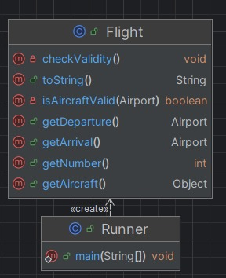
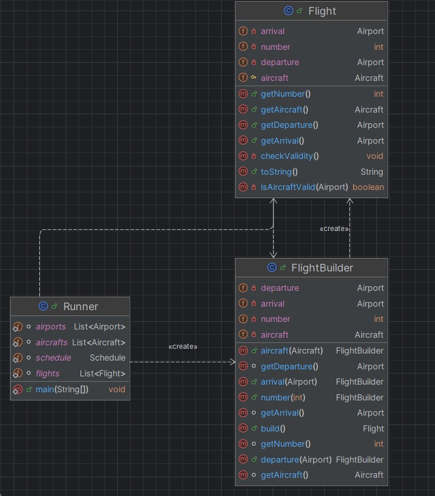

# Builder Pattern

## Applicability & Reasoning
- Context: `Flight` objects require multiple values (`number`, `departure`, `arrival`, `aircraft`) and runtime validation (`checkValidity()`). Tests and the `Runner` create many `Flight` instances.
- Problem addressed: long positional constructors are error-prone and hard to read; adding optional fields requires many constructors or breaking callers.
- Why Builder: the Builder pattern provides a fluent, readable API for constructing complex objects, centralizes validation, and makes tests/fixtures clearer.
- implemented a `FlightBuilder` (as a separate class in `flight.reservation.flight`) that collects parameters and calls a package-private `Flight(FlightBuilder)` constructor. Let `Flight` run its `checkValidity()` during construction so invariants are enforced exactly once.

## How to use (example)
```java
Flight flight = new FlightBuilder()
    .number(101)
    .departure(departureAirport)
    .arrival(arrivalAirport)
    .aircraft(aircraft)
    .build();
```

## Benefits
- Readability: named methods (`.number()`, `.departure()`) are self-documenting and avoid positional mistakes.
- Flexibility: easy to add optional fields (e.g., `gate`, `status`, `notes`) without breaking callers.
- Centralized validation: `build()` → `Flight(FlightBuilder)` → `checkValidity()` enforces invariants once and consistently.
- Extensibility: future fields can be added to the builder without exploding constructor overloads.
- Immutability: `Flight` instances can remain effectively immutable after construction if no setters exist.

## Drawbacks & Mitigations
- Debugging may require tracing through both `FlightBuilder` and `Flight` to find where validation or state assembly failed.
- More construction permutations increase test fixture surface; provide presets or factory helpers to keep tests focused and concise.

## class diagrams

<div style="display:flex;gap:10px;align-items:flex-start;">
    <div style="width:48%;text-align:center;">
        <div style="margin-top:6px;font-weight:600;">Before</div>
        
    </div>
    <div style="width:48%;text-align:center;">
        <div style="margin-bottom:6px;font-weight:600;">After</div>
        
    </div>
</div>

## Code Changes
added a builder class that enable adding any no of parameters in any order.below is the builder class

- `FlightBuilder.java` (simplified):

```java
package flight.reservation.flight;

import flight.reservation.Airport;
import flight.reservation.plane.Aircraft;

public class FlightBuilder {
    private int number;
    private Airport departure;
    private Airport arrival;
    private Aircraft aircraft;

    public FlightBuilder number(int number) { this.number = number; return this; }
    public FlightBuilder departure(Airport d) { this.departure = d; return this; }
    public FlightBuilder arrival(Airport a) { this.arrival = a; return this; }
    public FlightBuilder aircraft(Aircraft ac) { this.aircraft = ac; return this; }

    public Flight build() {
        return new Flight(this); // Flight(FlightBuilder) runs checkValidity()
    }

    int getNumber() { return number; }
    Airport getDeparture() { return departure; }
    Airport getArrival() { return arrival; }
    Aircraft getAircraft() { return aircraft; }
}
```
- Example usages (tests / Runner):

```java
// direct builder instantiation
Flight f1 = new FlightBuilder()
    .number(1)
    .departure(airports.get(0))
    .arrival(airports.get(1))
    .aircraft(aircrafts.get(0))
    .build();

// or, if you restore convenience method on Flight:
// Flight f2 = Flight.builder().number(2).departure(...).arrival(...).aircraft(...).build();
```
