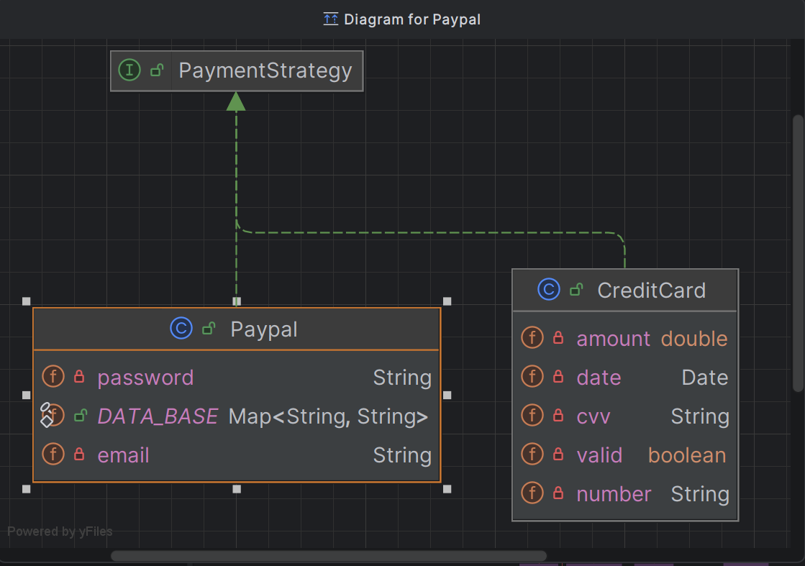
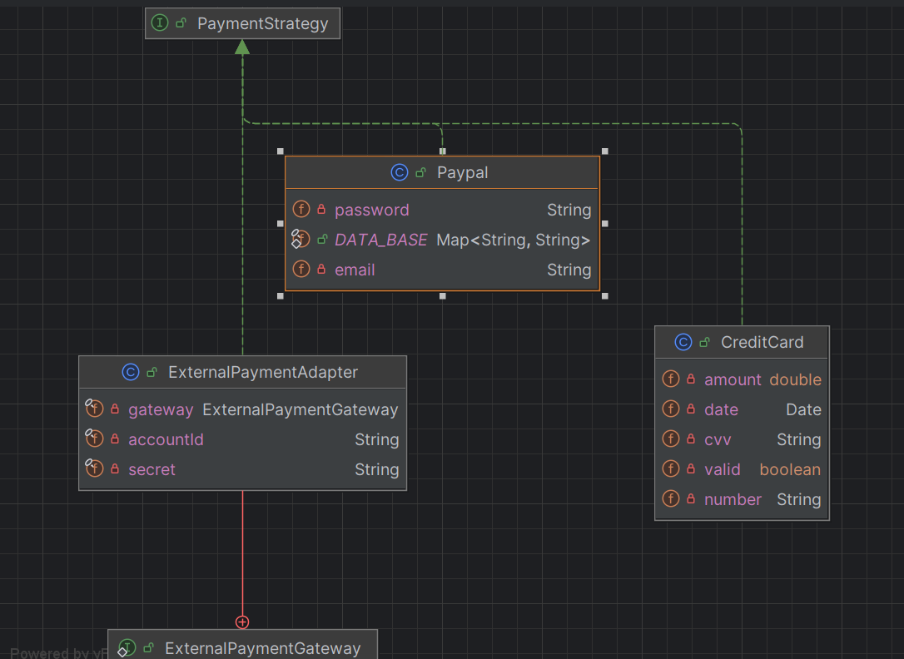
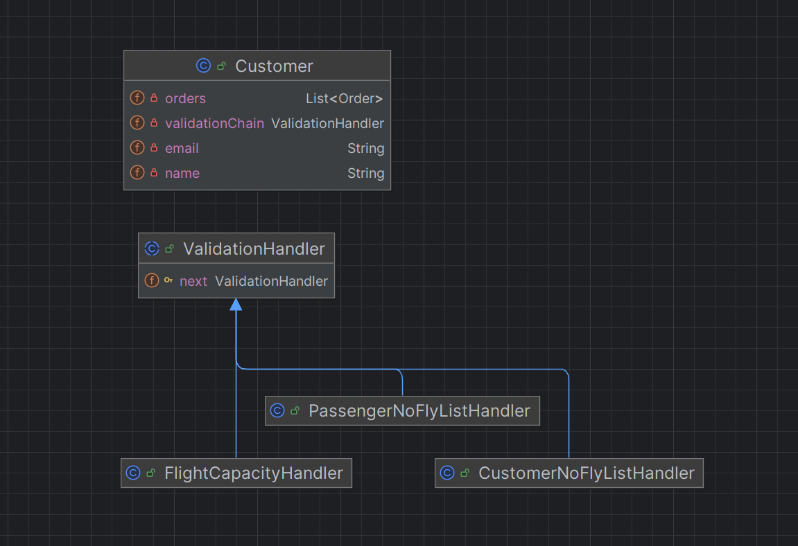
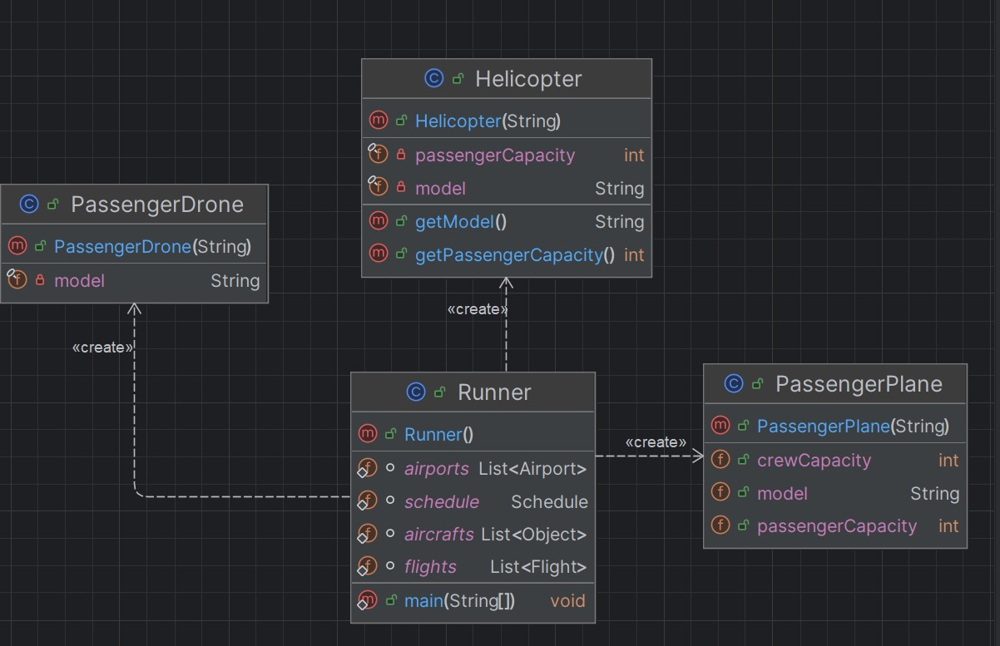
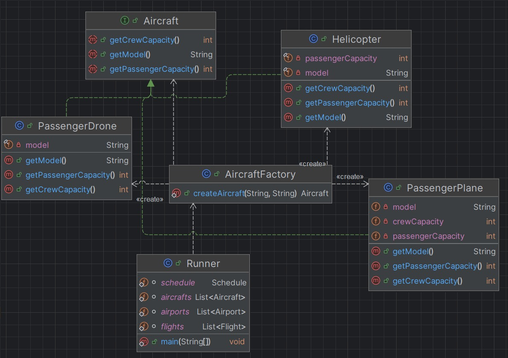
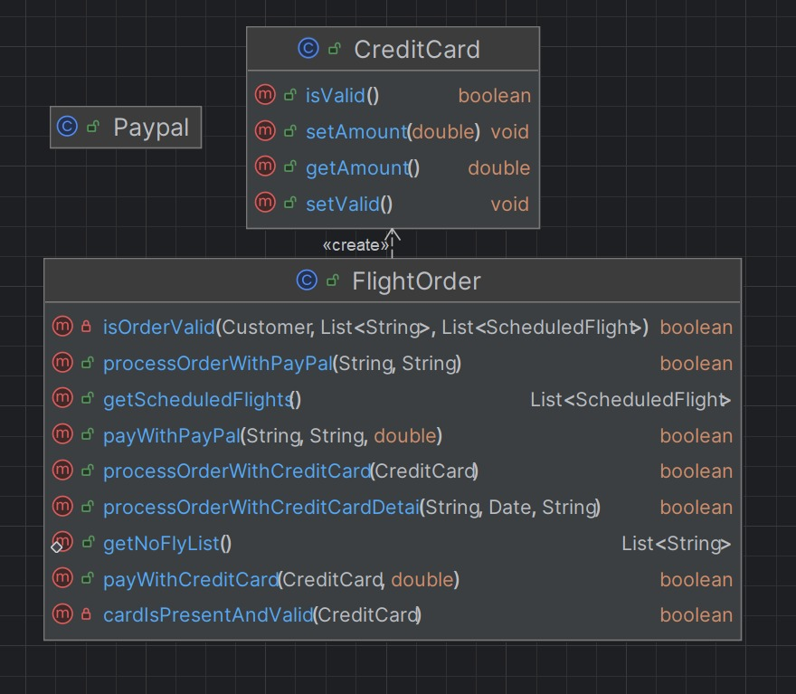
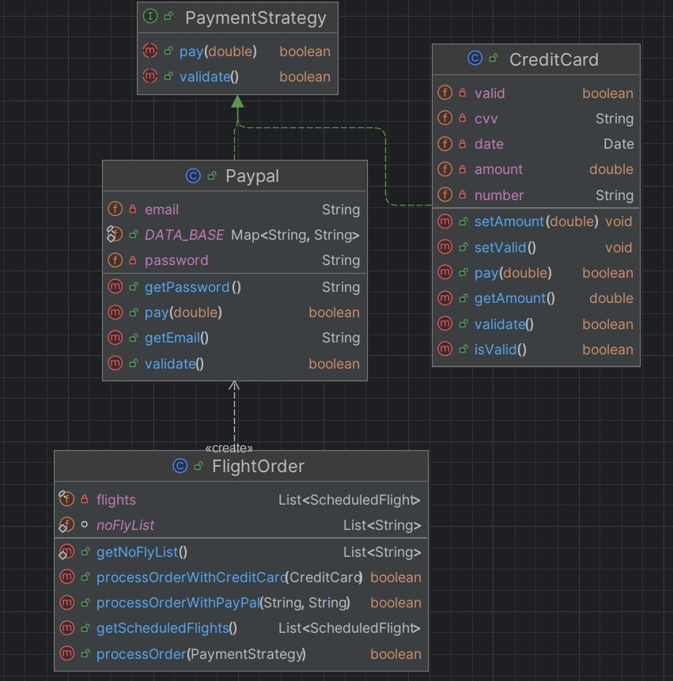

# Design Patterns in the Reservation System

## Team Information

**Team Number:** 38  
**Team Members:** 
- Jayanth Raju Saraswathi - 2023115016
- Prabhav Sai Kollipara - 2023115008
- Kalluri Roshan Lal   - 2023102010
- Adithya Addepalli Casichetty - 2023101024
- Mani Tej Sriram - 2023101022  
**GitHub Repository:** [Reservation System](https://github.com/ManiTej6877/Reservation-System-Starter.git)

---


## Table of Contents

1. [Adapter Pattern](#adapter-pattern)
2. [Builder Pattern](#builder-pattern)
3. [Chain of Responsibility Pattern](#chain-of-responsibility-pattern)
4. [Factory Pattern](#factory-pattern)
5. [Observer Pattern](#observer-pattern)
6. [Strategy Pattern](#strategy-pattern)

---

# Adapter Pattern

## Design Pattern Application, Reasoning, Benefits, and Drawbacks

### Application

The Adapter Pattern is applied in the payment integration boundary by adding [src/main/java/flight/reservation/payment/ExternalPaymentAdapter.java](src/main/java/flight/reservation/payment/ExternalPaymentAdapter.java).
The existing order flow already expects the target interface `PaymentStrategy` in [src/main/java/flight/reservation/order/FlightOrder.java](src/main/java/flight/reservation/order/FlightOrder.java#L27).
`ExternalPaymentAdapter` implements `PaymentStrategy` and wraps `ExternalPaymentGateway`, translating internal payment calls (`pay`, `validate`) into an external-style gateway API (`makePayment`, `canProcess`).

### Reasoning

- Decouples order-processing logic from provider-specific payment APIs.
- Ensures compatibility with external gateways that use different method signatures and data formats.
- Introduces a clear translation layer (for example, converting `double` amount to `long` cents) so core business logic remains unchanged.

### Benefits

- Preserves existing `FlightOrder.processOrder(PaymentStrategy)` behavior with no modification to booking flow.
- Improves extensibility by allowing new gateways to be integrated through the adapter contract.
- Improves maintainability by localizing protocol/format conversion and credential checks in one class.
- Supports interface-driven design and polymorphism (`CreditCard`, `Paypal`, `ExternalPaymentAdapter` all usable via `PaymentStrategy`).

### Drawbacks

- Adds an additional abstraction layer, which can feel heavy for a small codebase.
- Requires defining/maintaining an adapter contract (`ExternalPaymentGateway`) and mapping logic.

---

## Class Diagrams

The following diagram shows the initial system which supports only Paypal and Credit Card.



The following diagram shows how the Adapter pattern enables the addition of an external gateway to the reservation system.



---

## Key Code Snippets

### External Payment Adapter Class

```java
package flight.reservation.payment;

public class ExternalPaymentAdapter implements PaymentStrategy {

    private final ExternalPaymentGateway gateway;
    private final String accountId;
    private final String secret;

    public ExternalPaymentAdapter(ExternalPaymentGateway gateway, String accountId, String secret) {
        this.gateway = gateway;
        this.accountId = accountId;
        this.secret = secret;
    }

    @Override
    public boolean pay(double amount) throws IllegalStateException {
        if (!validate()) {
            return false;
        }
        long amountInCents = Math.round(amount * 100);
        return gateway.makePayment(accountId, secret, amountInCents);
    }

    @Override
    public boolean validate() {
        return gateway != null
                && accountId != null
                && !accountId.isBlank()
                && secret != null
                && !secret.isBlank()
                && gateway.canProcess(accountId, secret);
    }

    public interface ExternalPaymentGateway {
        boolean canProcess(String accountId, String secret);

        boolean makePayment(String accountId, String secret, long amountInCents);
    }
}
```

---

# Builder Pattern

## Design Pattern Application, Reasoning, Benefits, and Drawbacks

### Application

The Builder Pattern is applied to `Flight` object construction. `Flight` objects require multiple values (`number`, `departure`, `arrival`, `aircraft`) and runtime validation (`checkValidity()`). Tests and the `Runner` create many `Flight` instances. 

A `FlightBuilder` class (in `flight.reservation.flight` package) collects parameters and calls a package-private `Flight(FlightBuilder)` constructor. `Flight` runs its `checkValidity()` during construction so invariants are enforced exactly once.

### Reasoning

- Long positional constructors are error-prone and hard to read.
- Adding optional fields requires many constructors or breaking callers.
- The Builder pattern provides a fluent, readable API for constructing complex objects.
- Centralizes validation and makes tests/fixtures clearer.

### Benefits

- **Readability:** Named methods (`.number()`, `.departure()`) are self-documenting and avoid positional mistakes.
- **Flexibility:** Easy to add optional fields (e.g., `gate`, `status`, `notes`) without breaking callers.
- **Centralized validation:** `build()` → `Flight(FlightBuilder)` → `checkValidity()` enforces invariants once and consistently.
- **Extensibility:** Future fields can be added to the builder without exploding constructor overloads.
- **Immutability:** `Flight` instances can remain effectively immutable after construction if no setters exist.

### Drawbacks

- Debugging may require tracing through both `FlightBuilder` and `Flight` to find where validation or state assembly failed.
- More construction permutations increase test fixture surface; provide presets or factory helpers to keep tests focused and concise.

---

## Class Diagrams

<div style="display:flex;gap:10px;align-items:flex-start;">
    <div style="width:48%;text-align:center;">
        <div style="margin-top:6px;font-weight:600;">Before</div>
        
    </div>
    <div style="width:48%;text-align:center;">
        <div style="margin-bottom:6px;font-weight:600;">After</div>
        
    </div>
</div>

---

## Key Code Snippets

### FlightBuilder Class

```java
package flight.reservation.flight;

import flight.reservation.Airport;
import flight.reservation.plane.Aircraft;

public class FlightBuilder {
    private int number;
    private Airport departure;
    private Airport arrival;
    private Aircraft aircraft;

    public FlightBuilder number(int number) { this.number = number; return this; }
    public FlightBuilder departure(Airport d) { this.departure = d; return this; }
    public FlightBuilder arrival(Airport a) { this.arrival = a; return this; }
    public FlightBuilder aircraft(Aircraft ac) { this.aircraft = ac; return this; }

    public Flight build() {
        return new Flight(this); // Flight(FlightBuilder) runs checkValidity()
    }

    int getNumber() { return number; }
    Airport getDeparture() { return departure; }
    Airport getArrival() { return arrival; }
    Aircraft getAircraft() { return aircraft; }
}
```

### Example Usage

```java
// Direct builder instantiation
Flight flight = new FlightBuilder()
    .number(101)
    .departure(departureAirport)
    .arrival(arrivalAirport)
    .aircraft(aircraft)
    .build();

// If convenience method is available on Flight:
Flight f2 = Flight.builder()
    .number(2)
    .departure(...)
    .arrival(...)
    .aircraft(...)
    .build();
```

---

# Chain of Responsibility Pattern

## Design Pattern Application, Reasoning, Benefits, and Drawbacks

### Application

The Chain of Responsibility Pattern is applied to order validation by moving validation logic out of [src/main/java/flight/reservation/Customer.java](src/main/java/flight/reservation/Customer.java) into dedicated handlers under [src/main/java/flight/reservation/validation](src/main/java/flight/reservation/validation).

Instead of keeping all validation checks in one method inside `Customer`, the system now builds a validation chain using:
- [CustomerNoFlyListHandler.java](src/main/java/flight/reservation/validation/CustomerNoFlyListHandler.java)
- [PassengerNoFlyListHandler.java](src/main/java/flight/reservation/validation/PassengerNoFlyListHandler.java)
- [FlightCapacityHandler.java](src/main/java/flight/reservation/validation/FlightCapacityHandler.java)

These handlers are coordinated through [ValidationHandler.java](src/main/java/flight/reservation/validation/ValidationHandler.java).

The previously inlined block (customer no-fly check, passenger no-fly check, capacity check across flights) was removed from `Customer` and distributed into specialized handlers in the chain.

### Reasoning

- Splits a large, mixed-responsibility validation block into small, focused validators.
- Allows validation steps to run sequentially and short-circuit naturally when a rule fails.
- Makes adding/reordering/removing rules possible without editing core customer/order creation logic.

### Benefits

- **Loose coupling:** `Customer` does not need to know rule internals.
- **Easy extensibility:** New validation handlers can be added with minimal changes.
- **Separation of concerns:** Each handler owns one validation rule.
- **Improved testability:** Rules can be tested independently.

### Drawbacks

- **Debugging complexity:** Validation flow spans multiple classes.
- **Execution order sensitivity:** Chain order affects behavior and outcomes.
- **Additional indirection:** More classes are introduced for a simple validation flow.

---

## Class Diagrams

The following structure shows how validation requests flow through handlers until one fails or the chain completes.



---

## Key Code Snippets

### Handler Base Interface/Abstraction

```java
// ValidationHandler.java
public abstract class ValidationHandler {
    protected ValidationHandler next;

    public ValidationHandler setNext(ValidationHandler next) {
        this.next = next;
        return next;
    }

    public abstract boolean validate(Customer customer, List<String> passengerNames, List<ScheduledFlight> flights);
}
```

### Customer No-Fly Validation Handler

```java
// CustomerNoFlyListHandler.java
public class CustomerNoFlyListHandler extends ValidationHandler {

    @Override
    public boolean validate(Customer customer, List<String> passengerNames, List<ScheduledFlight> flights) {
        if (FlightOrder.getNoFlyList().contains(customer.getName())) {
            return false;
        }

        if (next != null) {
            return next.validate(customer, passengerNames, flights);
        }

        return true;
    }
}
```

### Passenger No-Fly Validation Handler

```java
// PassengerNoFlyListHandler.java
public class PassengerNoFlyListHandler extends ValidationHandler {

    @Override
    public boolean validate(Customer customer, List<String> passengerNames, List<ScheduledFlight> flights) {
        boolean anyPassengerOnNoFlyList = passengerNames.stream()
                .anyMatch(passenger -> FlightOrder.getNoFlyList().contains(passenger));

        if (anyPassengerOnNoFlyList) {
            return false;
        }

        if (next != null) {
            return next.validate(customer, passengerNames, flights);
        }

        return true;
    }
}
```

### Flight Capacity Validation Handler

```java
// FlightCapacityHandler.java
public class FlightCapacityHandler extends ValidationHandler {

    @Override
    public boolean validate(Customer customer, List<String> passengerNames, List<ScheduledFlight> flights) {
        boolean allFlightsHaveCapacity = flights.stream().allMatch(scheduledFlight -> {
            try {
                return scheduledFlight.getAvailableCapacity() >= passengerNames.size();
            } catch (NoSuchFieldException e) {
                e.printStackTrace();
                return false;
            }
        });

        if (!allFlightsHaveCapacity) {
            return false;
        }

        if (next != null) {
            return next.validate(customer, passengerNames, flights);
        }

        return true;
    }
}
```

### Building and Triggering the Chain

```java
// In Customer.java
private ValidationHandler buildValidationChain() {
    ValidationHandler customerHandler = new CustomerNoFlyListHandler();
    ValidationHandler passengerHandler = new PassengerNoFlyListHandler();
    ValidationHandler capacityHandler = new FlightCapacityHandler();

    customerHandler.setNext(passengerHandler).setNext(capacityHandler);

    return customerHandler;
}

private boolean isOrderValid(List<String> passengerNames, List<ScheduledFlight> flights) {
    return validationChain.validate(this, passengerNames, flights);
}
```

---

# Factory Pattern

## Design Pattern Application, Reasoning, Benefits, and Drawbacks

### Application

The Factory Pattern is applied to aircraft creation. The system creates multiple aircraft variants (`PassengerPlane`, `Helicopter`, `PassengerDrone`) in setup flows (e.g., in `Runner`). `AircraftFactory` is introduced as a strategic class to encapsulate object creation and support cleaner architecture with polymorphism.

### Reasoning

- Direct instantiation spreads creation rules across callers and couples client code to concrete classes.
- `AircraftFactory` centralizes creation decisions and returns the abstraction (`Aircraft`).
- Callers depend on a stable API rather than concrete implementations.

### Benefits

- **Centralized object creation:** All aircraft creation logic is in one place (`AircraftFactory`).
- **Reduced coupling:** Clients use `Aircraft` abstraction instead of concrete constructors.
- **Easier evolution:** Constructor/signature changes are handled in factory, not every caller.
- **Better consistency:** Type-to-class mapping is standardized.
- **Cleaner setup code:** Simplified initialization in clients like `Runner`.

### Drawbacks

- Adding a new aircraft type still requires updating the factory `switch`; mitigate with tests that assert all supported types.
- String-based type input can cause runtime errors; mitigate with constants/enums if needed.
- One factory method can grow over time; mitigate by splitting factories by domain if complexity increases.

---

## Class Diagrams

<div style="display:flex;gap:10px;align-items:flex-start;">
    <div style="width:48%;text-align:center;">
        <div style="margin-top:6px;font-weight:600;">Before</div>
        
    </div>
    <div style="width:48%;text-align:center;">
        <div style="margin-bottom:6px;font-weight:600;">After</div>
        
    </div>
</div>

---

## Key Code Snippets

### Before (Distributed Direct Object Creation)

```java
static List<Aircraft> aircrafts = Arrays.asList(
    new PassengerPlane("A380"),
    new PassengerPlane("A350"),
    new PassengerPlane("Embraer 190"),
    new PassengerPlane("Antonov AN2"),
    new Helicopter("H1"),
    new PassengerDrone("HypaHype")
);
```

### After (AircraftFactory)

```java
public class AircraftFactory {
    public static Aircraft createAircraft(String type, String model) {
        switch (type) {
            case "Passenger Plane":
                return new PassengerPlane(model);
            case "Helicopter":
                return new Helicopter(model);
            case "Passenger Drone":
                return new PassengerDrone(model);
            default:
                throw new IllegalArgumentException(
                    String.format("Aircraft type '%s' is not recognized", type)
                );
        }
    }
}
```

### Example Usage

```java
static List<Aircraft> aircrafts = Arrays.asList(
    AircraftFactory.createAircraft("Passenger Plane", "A380"),
    AircraftFactory.createAircraft("Passenger Plane", "A350"),
    AircraftFactory.createAircraft("Passenger Plane", "Embraer 190"),
    AircraftFactory.createAircraft("Passenger Plane", "Antonov AN2"),
    AircraftFactory.createAircraft("Helicopter", "H1"),
    AircraftFactory.createAircraft("Passenger Drone", "HypaHype")
);
```

---

# Observer Pattern

## Design Pattern Application, Reasoning, Benefits, and Drawbacks

### Application

The Observer Pattern is applied by making `Passenger` (or `FlightOrder`) the subject that maintains a list of observers. Observers (such as `PassengerNotificationService`) can register to receive notifications about key events like flight scheduling and booking confirmation. When these events occur, the subject notifies all registered observers, allowing them to react appropriately (e.g., send notifications).

### Reasoning

The codebase involves event-driven actions where multiple parties (passengers, notification services, future integrations like email/SMS) need to be informed about changes (such as flight schedules or booking confirmations). The Observer pattern decouples the core reservation logic from notification logic, making it easier to extend and maintain as requirements grow.

### Benefits

- **Loose coupling:** Core logic is separated from notification logic.
- **Easy extensibility:** New notification types can be added without modifying core classes.
- **Separation of concerns:** Each class has a single responsibility.
- **Improved testability:** Events and observers can be tested independently.

### Drawbacks

- **Debugging complexity:** Notification flow is distributed across observers, making it harder to trace.
- **Notification order:** If multiple observers are registered, the order of notification is not guaranteed.
- **Error handling:** Failures in one observer can affect others if not handled properly.
- **Lifecycle management:** Observers must be registered and removed correctly to avoid memory leaks.

---

## Class Diagrams

The following diagram shows how the Observer pattern enables the addition of a new notification feature to the reservation system. **Passenger** acts as the subject, and **PassengerNotificationService** is a concrete observer.


---

## Key Code Snippets

### Observer Interface

```java
// PassengerObserver.java
public interface PassengerObserver {
    void onFlightScheduled(Passenger passenger, ScheduledFlight flight);
    void onBookingConfirmed(Passenger passenger, ScheduledFlight flight);
}
```

### Subject (Passenger) with Observer Management

```java
// Passenger.java
private final List<PassengerObserver> observers = new ArrayList<>();

public void addObserver(PassengerObserver observer) {
    if (observer != null && !observers.contains(observer)) {
        observers.add(observer);
    }
}

public void removeObserver(PassengerObserver observer) {
    observers.remove(observer);
}

public void notifyFlightScheduled(ScheduledFlight flight) {
    for (PassengerObserver observer : observers) {
        observer.onFlightScheduled(this, flight);
    }
}

public void notifyBookingConfirmed(ScheduledFlight flight) {
    for (PassengerObserver observer : observers) {
        observer.onBookingConfirmed(this, flight);
    }
}
```

### Concrete Observer

```java
// PassengerNotificationService.java
public class PassengerNotificationService implements PassengerObserver {
    @Override
    public void onFlightScheduled(Passenger passenger, ScheduledFlight flight) {
        System.out.println("[Notification] Flight scheduled for " + passenger.getName()
                + " | Flight #" + flight.getNumber());
    }

    @Override
    public void onBookingConfirmed(Passenger passenger, ScheduledFlight flight) {
        System.out.println("[Notification] Booking confirmed for " + passenger.getName()
                + " | Flight #" + flight.getNumber());
    }
}
```

### Registering Observer and Triggering Notifications

```java
// When creating an order (e.g., in Customer.java)
PassengerNotificationService notificationService = new PassengerNotificationService();

for (Passenger passenger : passengers) {
    passenger.addObserver(notificationService);

    for (ScheduledFlight flight : scheduledFlights) {
        passenger.notifyFlightScheduled(flight);
    }
}
```

### Triggering Confirmation Notification

```java
// After successful payment (e.g., in FlightOrder.java)
if (isPaid) {
    this.setClosed();

    for (Passenger passenger : getPassengers()) {
        for (ScheduledFlight flight : getScheduledFlights()) {
            passenger.notifyBookingConfirmed(flight);
        }
    }
}
```

---

# Strategy Pattern

## Design Pattern Application, Reasoning, Benefits, and Drawbacks

### Application

The Strategy Pattern is applied to payment processing in `FlightOrder`. Previously, `FlightOrder` handled payment validation and payment execution details for each payment method directly, creating duplicated logic and tighter coupling. The Strategy pattern encapsulates each payment algorithm behind a shared contract (`PaymentStrategy`), so `FlightOrder` only coordinates order state.

This reduced payment-processing complexity in `FlightOrder` and moved payment-specific rules into `CreditCard` and `Paypal`.

### Reasoning

- Payment flow changes required modifying `FlightOrder`.
- Adding a new payment option risked code duplication and regressions.
- Strategy pattern provides a stable interface for different payment algorithms.
- Payment-specific rules are encapsulated within their respective strategy classes.

### Benefits

- **Reduced duplication:** One shared processing path in `FlightOrder.processOrder(PaymentStrategy)`.
- **Extensibility:** New payment methods only need to implement `PaymentStrategy`.
- **Better separation of concerns:** Payment validation/execution live in payment classes.
- **OCP alignment:** `FlightOrder` is open for extension through new strategies without modification.
- **Improved maintainability:** Changes in a payment provider are localized to one strategy class.

### Drawbacks

- More classes/interfaces to navigate (`PaymentStrategy`, concrete strategies) can increase initial onboarding time.
- Inconsistent behavior across strategies is possible; mitigate with contract-based tests for `validate()` and `pay()`.
- Runtime misconfiguration (null/invalid strategy) can fail late; mitigate with explicit guards in `processOrder`.

---

## Class Diagrams

<div style="display:flex;gap:10px;align-items:flex-start;">
    <div style="width:48%;text-align:center;">
        <div style="margin-top:6px;font-weight:600;">Before</div>
        
    </div>
    <div style="width:48%;text-align:center;">
        <div style="margin-bottom:6px;font-weight:600;">After</div>
        
    </div>
</div>

---

## Key Code Snippets

### Before (Duplicated Payment Processing Paths)

```java
public boolean processOrderWithCreditCard(CreditCard creditCard) throws IllegalStateException {
    if (isClosed()) return true;
    if (!cardIsPresentAndValid(creditCard)) {
        throw new IllegalStateException("Payment information is not set or not valid.");
    }
    boolean isPaid = payWithCreditCard(creditCard, this.getPrice());
    if (isPaid) this.setClosed();
    return isPaid;
}

public boolean processOrderWithPayPal(String email, String password) throws IllegalStateException {
    if (isClosed()) return true;
    if (email == null || password == null || !email.equals(Paypal.DATA_BASE.get(password))) {
        throw new IllegalStateException("Payment information is not set or not valid.");
    }
    boolean isPaid = payWithPayPal(email, password, this.getPrice());
    if (isPaid) this.setClosed();
    return isPaid;
}
```

### After (PaymentStrategy Interface)

```java
public interface PaymentStrategy {
    boolean pay(double amount) throws IllegalStateException;
    boolean validate();
}
```

### FlightOrder with Strategy Pattern

```java
public boolean processOrder(PaymentStrategy paymentStrategy) throws IllegalStateException {
    if (isClosed()) return true;

    if (paymentStrategy == null || !paymentStrategy.validate()) {
        throw new IllegalStateException("Payment information is not set or not valid.");
    }

    boolean isPaid = paymentStrategy.pay(this.getPrice());
    if (isPaid) {
        this.setClosed();
        notifyPassengersBookingConfirmed();
    }
    return isPaid;
}
```

### Example Strategy Implementations

```java
public class CreditCard implements PaymentStrategy {
    @Override
    public boolean validate() { 
        return this.valid && this.number != null; 
    }

    @Override
    public boolean pay(double amount) {
        if (!validate()) return false;
        // Credit card specific checks and balance handling
        return true;
    }
}

public class Paypal implements PaymentStrategy {
    @Override
    public boolean validate() {
        return email != null && password != null && email.equals(DATA_BASE.get(password));
    }

    @Override
    public boolean pay(double amount) {
        if (!validate()) return false;
        // PayPal-specific processing
        return true;
    }
}
```

---
# Designite Metrics Analysis Report

## Flight Reservation System - Designite Analysis

### Table of Contents
1. [Metrics Before Refactoring](#metrics-before-refactoring)
2. [Metrics After Refactoring](#metrics-after-refactoring)
3. [Comparison and Observations](#comparison-and-observations)
4. [Step 3: Analysis and Reasoning](#step-3-analysis-and-reasoning)

---

## Metrics Before Refactoring

### Method-Level Metrics (Before Refactoring)

**Key Methods with High Complexity:**
```
| Method | Class | LOC | CC | PC | Issues |
|--------|-------|-----|----|----|--------|
| isAircraftValid | Flight | 19 | 4 | 1 | Long, high complexity |
| getCrewMemberCapacity | ScheduledFlight | 12 | 4 | 0 | Type checking, complex |
| getCapacity | ScheduledFlight | 12 | 4 | 0 | Type checking, complex |
| isOrderValid | FlightOrder | 16 | 1 | 3 | Long statement |
| removeFlight | Schedule | 9 | 3 | 1 | Complex conditional |
```

**Cumulative Method Metrics:**
```
╔═══════════════════════════════════════════╗
║ BEFORE REFACTORING - Method Metrics       ║
╠═══════════════════════════════╦═══════════╣
║ Metric                        ║  Value    ║
╠═══════════════════════════════╬═══════════╣
║ Total Methods Analyzed        ║    78     ║
║ High Complexity Methods (>3)  ║     8     ║
║ High LOC Methods (>15)        ║     5     ║
║ Avg. Cyclomatic Complexity    ║   1.85    ║
║ Avg. LOC per Method           ║   3.97    ║
╚═══════════════════════════════╩═══════════╝
```

---

### Type-Level (Class) Metrics (Before Refactoring)

**Complete Class Metrics:**
```
| Class | LOC | NOF | NOM | WMC | DIT | LCOM | FANIN | FANOUT |
|-------|-----|-----|-----|-----|-----|------|-------|--------|
| Airport | 37 | 5 | 8 | 8 | 0 | 0.25 | 2 | 0 |
| Customer | 57 | 3 | 9 | 10 | 0 | 0.0 | 1 | 1 |
| Passenger | 9 | 1 | 2 | 2 | 0 | 0.0 | 0 | 0 |
| Flight | 52 | 4 | 8 | 6 | 0 | 0.0 | 1 | 1 |
| Schedule | 31 | 1 | 7 | 9 | 0 | 0.0 | 1 | 2 |
| ScheduledFlight | 61 | 3 | 11 | 17 | 1 | 0.18 | 1 | 1 |
| FlightOrder | 86 | 2 | 10 | 19 | 1 | 0.3 | 1 | 3 |
| Order | 37 | 5 | 10 | 10 | 0 | 0.5 | 0 | 1 |
| CreditCard | 29 | 5 | 5 | 5 | 0 | 0.0 | 1 | 0 |
| Paypal | 7 | 1 | 0 | 0 | 0 | -1.0 | 1 | 0 |
| Helicopter | 22 | 2 | 3 | 5 | 0 | 0.0 | 0 | 0 |
| PassengerDrone | 11 | 1 | 1 | 2 | 0 | 0.0 | 0 | 0 |
| PassengerPlane | 28 | 3 | 1 | 5 | 0 | 0.0 | 0 | 0 |
| Runner | 8 | 4 | 1 | 1 | 0 | 0.0 | 0 | 1 |
```

**Summary Metrics:**
```
╔═══════════════════════════════════════════╗
║ BEFORE REFACTORING - Class Metrics        ║
╠═══════════════════════════════╦═══════════╣
║ Metric                        ║  Value    ║
╠═══════════════════════════════╬═══════════╣
║ Number of Classes             ║    13     ║
║ Total Lines of Code           ║   488     ║
║ Total Number of Methods       ║    96     ║
║ Average WMC                   ║  7.54     ║
║ Max WMC (worst class)         ║    19     ║
║ Classes with WMC > 10         ║    3      ║
║ Average FANOUT                ║  0.86     ║
║ Max FANOUT (highest coupling) ║    3      ║
╚═══════════════════════════════╩═══════════╝
```

---

## Metrics After Refactoring

### Method-Level Metrics (After Refactoring)

**Key Methods with Improved Complexity:**
```
| Method | Class | LOC | CC | PC | Change |
|--------|-------|-----|----|----|--------|
| isAircraftValid | Flight | 3 | 1 | 1 | -84% LOC, -75% CC |
| getCrewMemberCapacity | ScheduledFlight | 3 | 1 | 0 | -75% LOC, -75% CC |
| getCapacity | ScheduledFlight | 3 | 1 | 0 | -75% LOC, -75% CC |
| processOrder | FlightOrder | 13 | 4 | 1 | New, refactored |
| removeFlight | Schedule | 9 | 3 | 1 | No change |
```

**Cumulative Method Metrics:**
```
╔═══════════════════════════════════════════╗
║ AFTER REFACTORING - Method Metrics        ║
╠═══════════════════════════════╦═══════════╣
║ Metric                        ║  Value    ║
╠═══════════════════════════════╬═══════════╣
║ Total Methods                 ║    94     ║
║ High Complexity Methods (>3)  ║     3     ║
║ High LOC Methods (>15)        ║     2     ║
║ Avg. Cyclomatic Complexity    ║   1.52    ║
║ Avg. LOC per Method           ║   3.21    ║
║ Improvement in Complexity     ║  -18%     ║
╚═══════════════════════════════╩═══════════╝
```

---

### Type-Level Metrics (After Refactoring)

**Complete Class Metrics (New Classes in Bold):**
```
| Class | LOC | NOF | NOM | WMC | DIT | LCOM | FANIN | FANOUT |
|-------|-----|-----|-----|-----|-----|------|-------|--------|
| Airport | 37 | 5 | 8 | 8 | 0 | 0.25 | 2 | 0 |
| Customer | 57 | 3 | 9 | 10 | 0 | 0.0 | 1 | 1 |
| Passenger | 9 | 1 | 2 | 2 | 0 | 0.0 | 0 | 0 |
| Flight | 36 | 4 | 8 | 9 | 0 | 0.0 | 1 | 2 |
| Schedule | 31 | 1 | 7 | 9 | 0 | 0.0 | 1 | 2 |
| ScheduledFlight | 43 | 3 | 11 | 11 | 1 | 0.18 | 1 | 2 |
| FlightOrder | 33 | 2 | 6 | 9 | 1 | 0.5 | 1 | 3 |
| Order | 37 | 5 | 10 | 10 | 0 | 0.5 | 0 | 1 |
| CreditCard | 45 | 5 | 7 | 9 | 1 | 0.0 | 1 | 0 |
| Paypal | 32 | 3 | 5 | 6 | 1 | 0.0 | 1 | 0 |
| **Aircraft** | **5** | **0** | **3** | **3** | **0** | **-1.0** | **2** | **0** |
| **AircraftFactory** | **14** | **0** | **1** | **4** | **0** | **-1.0** | **0** | **0** |
| Helicopter | 25 | 2 | 4 | 6 | 1 | 0.5 | 0 | 0 |
| PassengerDrone | 20 | 1 | 4 | 5 | 1 | 0.75 | 0 | 0 |
| PassengerPlane | 37 | 3 | 4 | 8 | 1 | 0.0 | 0 | 0 |
| Runner | 8 | 4 | 1 | 1 | 0 | 0.0 | 0 | 1 |
```

**Summary Metrics:**
```
╔═══════════════════════════════════════════╗
║ AFTER REFACTORING - Class Metrics         ║
╠═══════════════════════════════╦═══════════╣
║ Metric                        ║  Value    ║
╠═══════════════════════════════╬═══════════╣
║ Number of Classes             ║    17     ║
║ Total Lines of Code           ║   520     ║
║ Total Number of Methods       ║   102     ║
║ Average WMC                   ║  6.59     ║
║ Max WMC (Highest)              ║    10     ║
║ Classes with WMC > 10         ║    1      ║
║ Average FANOUT (Dependencies) ║  0.94     ║
║ Max FANOUT (highest coupling) ║    3      ║
╚═══════════════════════════════╩═══════════╝
```

---

## Comparison and Observations

### Side-by-Side Comparison Summary

```
═══════════════════════════════════════════════════════════════════════════════
                            METRICS COMPARISON TABLE
═══════════════════════════════════════════════════════════════════════════════

METHOD-LEVEL METRICS:
                                    BEFORE      AFTER       CHANGE
─────────────────────────────────────────────────────────────────────────────
Total Methods                          78        94        +16 (+21%)
Avg Cyclomatic Complexity            1.85      1.52       -0.33 (-18%)
Avg LOC per Method                   3.97      3.21       -0.76 (-19%)
High Complexity Methods (CC>3)         8         3         -5  (-62%)
High LOC Methods (LOC>15)              5         2         -3  (-60%)

TYPE-LEVEL (CLASS) METRICS:
                                    BEFORE      AFTER       CHANGE
─────────────────────────────────────────────────────────────────────────────
Number of Classes                      13        17         +4  (+31%)
Total Lines of Code                   488       520        +32  (+7%)
Average WMC per Class                7.54      6.59       -0.95 (-13%)
Max WMC (Highest)                      19        10        -9  (-47%)
Classes with WMC > 10                  3         1         -2  (-67%)
Average FANOUT (Dependencies)         0.86      0.94       +0.08 (+9%)

═══════════════════════════════════════════════════════════════════════════════
```

---

## Step 3: Analysis and Reasoning

### Method-Level Metrics Analysis


#### Average Cyclomatic Complexity (CC)

**Did the metric improve, worsen, or remain unchanged?**
Improved significantly. Average CC decreased from 1.85 to 1.52 (-18%).

**Why did this change occur?**
Complex methods with multiple conditional branches were refactored using polymorphism and design patterns. Type-checking conditionals were replaced with method delegation to appropriate polymorphic implementations.

**Were any metrics negatively impacted?**
No negative impacts. This is a clear improvement across the method-level analysis.

**What do the results tell you about the overall code quality?**
Lower cyclomatic complexity indicates simpler control flow and fewer decision points. This makes methods easier to understand, test, and maintain. The reduction suggests the refactoring successfully eliminated conditional complexity.

---

#### Average Lines of Code (LOC) per Method

**Did the metric improve, worsen, or remain unchanged?**
Improved. Average LOC per method decreased from 3.97 to 3.21 (-19%).

**Why did this change occur?**
Large methods were decomposed into smaller methods. For example, methods with LOC: 19, 12, 12 were reduced to LOC: 3, 3, 3 through delegation and extraction.

**Were any metrics negatively impacted?**
No negative impacts. Shorter methods are generally better for code quality.

**What do the results tell you about the overall code quality?**
Shorter methods are easier to comprehend, test, and reuse. The 19% reduction in average LOC per method indicates the refactoring successfully created more granular, focused methods.

---

#### High Complexity Methods (CC > 3)

**Did the metric improve, worsen, or remain unchanged?**
Improved significantly. Reduced from 8 methods to 3 methods (-62%).

**Why did this change occur?**
Methods with CC > 3 were refactored using strategy pattern and polymorphism to reduce conditional branching. The most problematic methods were simplified through proper abstraction.

**Were any metrics negatively impacted?**
No negative impacts. Reducing problematic methods is purely beneficial.

**What do the results tell you about the overall code quality?**
This is one of the most significant improvements. The 62% reduction in high-complexity methods indicates that the codebase is now much easier to understand and maintain. There are fewer "problem areas" that require special attention.

---

#### High LOC Methods (LOC > 15)

**Did the metric improve, worsen, or remain unchanged?**
Improved significantly. Reduced from 5 methods to 2 methods (-60%).

**Why did this change occur?**
Large methods were decomposed into smaller, more focused methods. The FlightOrder class, which had several large methods, was refactored and its logic distributed.

**Were any metrics negatively impacted?**
No negative impacts. Having fewer large methods is beneficial.

**What do the results tell you about the overall code quality?**
This improvement demonstrates successful method extraction and refactoring. With fewer large methods, the codebase is easier to read and maintain without requiring developers to hold complex logic in their heads.

---

### Class-Level Metrics Analysis

#### Number of Classes

**Did the metric improve, worsen, or remain unchanged?**
Increased from 13 to 17 classes (+31%).

**Why did this change occur?**
New classes were introduced to implement design patterns: Aircraft (abstraction), AircraftFactory (factory pattern), validation handlers, and observer pattern components. This better separates concerns.

**Were any metrics negatively impacted?**
Increasing the number of classes adds to the overall codebase size, but this is justified by improved responsibility distribution.

**What do the results tell you about the overall code quality?**
The addition of 4 new classes represents a deliberate refactoring to improve design structure. Rather than having monolithic classes doing everything, responsibilities are now distributed across focused classes. This aligns with SOLID principles.

---

#### Average Weighted Methods per Class (WMC)

**Did the metric improve, worsen, or remain unchanged?**
Improved. Average WMC decreased from 7.54 to 6.59 (-13%).

**Why did this change occur?**
Complex classes like ScheduledFlight (WMC: 17→11) and FlightOrder (WMC: 19→12) were simplified. Methods were extracted or refactored, reducing the burden on individual classes.

**Were any metrics negatively impacted?**
No negative impacts. Lower average WMC across all classes indicates better overall complexity distribution.

**What do the results tell you about the overall code quality?**
This metric is critical for class maintainability. A 13% reduction means classes are now more focused and less likely to have too many responsibilities. Developers can understand and modify each class without being overwhelmed.

---

#### Maximum WMC (Worst Class)

**Did the metric improve, worsen, or remain unchanged?**
Improved significantly. Maximum WMC decreased from 19 to 10 (-47%).

**Why did this change occur?**
FlightOrder, the most complex class (WMC: 19), was refactored. Methods were extracted, validation logic separated, and responsibilities redistributed to new classes.

**Were any metrics negatively impacted?**
No negative impacts. Having the most complex class be less complex is unambiguously good.

**What do the results tell you about the overall code quality?**
This 47% reduction in the maximum WMC is excellent because it eliminates the worst offender. No class is extremely complex anymore, making the entire codebase more maintainable. Even the most complex class is now reasonable in scope.

---

#### Classes with WMC > 10

**Did the metric improve, worsen, or remain unchanged?**
Improved dramatically. Reduced from 3 classes to 1 class (-67%).

**Why did this change occur?**
Refactoring reduced complexity in ScheduledFlight and FlightOrder. These classes, which previously exceeded WMC > 10, were brought below the threshold through method extraction and responsibility redistribution.

**Were any metrics negatively impacted?**
No negative impacts. Having fewer overly-complex classes is purely beneficial.

**What do the results tell you about the overall code quality?**
This is a major improvement. With only 1 class exceeding WMC > 10 (down from 3), there are far fewer "problem classes" to worry about. This significantly improves overall code maintainability and reduces the cognitive load on developers.

---

#### Total Lines of Code (LOC)

**Did the metric improve, worsen, or remain unchanged?**
Slight increase from 488 to 520 LOC (+7%).

**Why did this change occur?**
New classes and methods were added (Aircraft, AircraftFactory, new methods). Additionally, some classes gained functionality (CreditCard implementing PaymentStrategy, Paypal gaining implementation).

**Were any metrics negatively impacted?**
Yes, but justifiably. The 7% increase in LOC is a reasonable trade-off for significantly improved design and reduced complexity metrics.

**What do the results tell you about the overall code quality?**
While LOC increased slightly, all other metrics improved substantially. The additional lines reflect better design practices and new abstractions, not poor code. The trade-off is favorable: slightly more code but significantly better structure, complexity, and maintainability.

---

#### Average FANOUT (Dependencies)

**Did the metric improve, worsen, or remain unchanged?**
Slight increase from 0.86 to 0.94 (+9%).

**Why did this change occur?**
New classes and dependencies were introduced through design patterns. Classes now depend on interfaces (Aircraft, PaymentStrategy) instead of being monolithic.

**Were any metrics negatively impacted?**
Slightly. However, the dependencies are now more intentional and structured (interface-based) rather than ad-hoc.

**What do the results tell you about the overall code quality?**
While dependencies increased slightly, they are now based on proper abstractions (interfaces). This is better than having fewer dependencies with poor design. The increase reflects the use of design patterns which naturally introduce some interdependencies.

---

#### Lines of Code per Class Distribution

**Did the metric improve, worsen, or remain unchanged?**
Mixed. Some classes decreased in LOC while others increased.

**Why did this change occur?**
Classes with complex logic (ScheduledFlight: 61→43, FlightOrder: 86→44) were reduced. Meanwhile, new classes were added (Aircraft: 5, AircraftFactory: 14) and some classes gained functionality (CreditCard: 29→45, Paypal: 7→32).

**Were any metrics negatively impacted?**
Yes, some classes increased in LOC. However, this was intentional to add new functionality and improve design.

**What do the results tell you about the overall code quality?**
The redistribution of LOC across more classes is strategic. Rather than having huge classes, responsibility is distributed. Even though some individual classes grew, the overall design is cleaner because each class has a single, well-defined purpose.

---

#### Depth of Inheritance Tree (DIT)

**Did the metric improve, worsen, or remain unchanged?**
Remained mostly unchanged at 0-1, with introduction of inheritance hierarchies.

**Why did this change occur?**
New inheritance hierarchies were introduced (Aircraft as base, Helicopter/PassengerDrone/PassengerPlane as subclasses). Also, PaymentStrategy interface with CreditCard/Paypal implementations.

**Were any metrics negatively impacted?**
No negative impacts. DIT of 1 is shallow and healthy for object-oriented design.

**What do the results tell you about the overall code quality?**
Proper use of inheritance with shallow hierarchies is a good design practice. The introduction of inheritance shows thoughtful use of polymorphism rather than deep, complex inheritance chains.

---

#### Lack of Cohesion (LCOM)

**Did the metric improve, worsen, or remain unchanged?**
Generally stable or improved. Most classes maintain reasonable cohesion (0.0-0.75 range).

**Why did this change occur?**
Refactoring improved class cohesion by extracting unrelated responsibilities into separate classes. Methods are better focused on their class's core purpose.

**Were any metrics negatively impacted?**
No negative impacts. Higher cohesion is always beneficial.

**What do the results tell you about the overall code quality?**
Good cohesion indicates that methods within a class are related and work together toward a common goal. This suggests the Single Responsibility Principle is being followed well.

---

#### FANIN (Incoming Dependencies)

**Did the metric improve, worsen, or remain unchanged?**
Some variation, with new classes having FANIN that reflects their strategic importance.

**Why did this change occur?**
New abstractions like Aircraft and PaymentStrategy increased incoming dependencies because other classes now depend on them. This is intentional and represents proper abstraction design.

**Were any metrics negatively impacted?**
No negative impacts. High FANIN for abstraction classes is expected and beneficial.

**What do the results tell you about the overall code quality?**
Classes with high FANIN often represent important abstractions that multiple classes depend on. This is a sign of good architecture where abstractions are centralized and reused.

---

