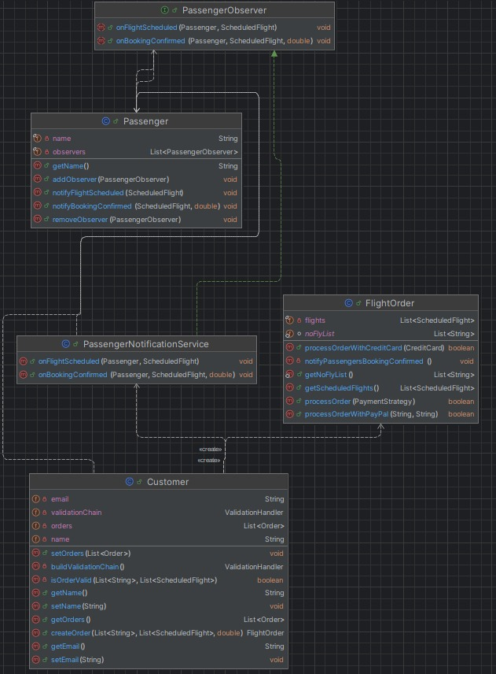

# Observer Pattern in the Reservation System

## Design Pattern Application, Reasoning, Benefits, and Drawbacks

### Application
The Observer pattern is applied by making `Passenger` (or `FlightOrder`) the subject that maintains a list of observers. Observers (such as `PassengerNotificationService`) can register to receive notifications about key events like flight scheduling and booking confirmation. When these events occur, the subject notifies all registered observers, allowing them to react appropriately (e.g., send notifications).

### Reasoning
The codebase involves event-driven actions where multiple parties (passengers, notification services, future integrations like email/SMS) need to be informed about changes (such as flight schedules or booking confirmations). The Observer pattern decouples the core reservation logic from notification logic, making it easier to extend and maintain as requirements grow.

### Benefits
- **Loose coupling:** Core logic is separated from notification logic.
- **Easy extensibility:** New notification types can be added without modifying core classes.
- **Separation of concerns:** Each class has a single responsibility.
- **Improved testability:** Events and observers can be tested independently.

### Drawbacks
- **Debugging complexity:** Notification flow is distributed across observers, making it harder to trace.
- **Notification order:** If multiple observers are registered, the order of notification is not guaranteed.
- **Error handling:** Failures in one observer can affect others if not handled properly.
- **Lifecycle management:** Observers must be registered and removed correctly to avoid memory leaks.

---

## Adding Notification Feature Using Observer Pattern

The following diagram shows how the Observer pattern enables the addition of a new notification feature to the reservation system.  
**Passenger** acts as the subject, and **PassengerNotificationService** is a concrete observer.  
This design allows you to notify passengers about flight schedules and booking confirmations.



---

## Observer Pattern for Passenger Notifications

This project demonstrates a **Observer Pattern** implementation for notifying passengers about flight schedules and booking confirmations in a reservation system.

---

## Overview

- **Subject:** `Passenger`  
- **Observer Interface:** `PassengerObserver`  
- **Concrete Observer:** `PassengerNotificationService`  
- **Events:**  
  - Flight scheduled  
  - Booking confirmed  

---

## Key Code Snippets

### 1. Observer Interface

```java
// PassengerObserver.java
public interface PassengerObserver {
    void onFlightScheduled(Passenger passenger, ScheduledFlight flight);
    void onBookingConfirmed(Passenger passenger, ScheduledFlight flight);
}
```

---

### 2. Subject (`Passenger`) with Observer Management

```java
// Passenger.java
private final List<PassengerObserver> observers = new ArrayList<>();

public void addObserver(PassengerObserver observer) {
    if (observer != null && !observers.contains(observer)) {
        observers.add(observer);
    }
}

public void removeObserver(PassengerObserver observer) {
    observers.remove(observer);
}

public void notifyFlightScheduled(ScheduledFlight flight) {
    for (PassengerObserver observer : observers) {
        observer.onFlightScheduled(this, flight);
    }
}

public void notifyBookingConfirmed(ScheduledFlight flight) {
    for (PassengerObserver observer : observers) {
        observer.onBookingConfirmed(this, flight);
    }
}
```

---

### 3. Concrete Observer

```java
// PassengerNotificationService.java
public class PassengerNotificationService implements PassengerObserver {
    @Override
    public void onFlightScheduled(Passenger passenger, ScheduledFlight flight) {
        System.out.println("[Notification] Flight scheduled for " + passenger.getName()
                + " | Flight #" + flight.getNumber());
    }

    @Override
    public void onBookingConfirmed(Passenger passenger, ScheduledFlight flight) {
        System.out.println("[Notification] Booking confirmed for " + passenger.getName()
                + " | Flight #" + flight.getNumber());
    }
}
```

---

### 4. Registering Observer and Triggering Notifications

```java
// When creating an order (e.g., in Customer.java)
PassengerNotificationService notificationService = new PassengerNotificationService();

for (Passenger passenger : passengers) {
    passenger.addObserver(notificationService);

    for (ScheduledFlight flight : scheduledFlights) {
        passenger.notifyFlightScheduled(flight);
    }
}
```

---

### 5. Triggering Confirmation Notification

```java
// After successful payment (e.g., in FlightOrder.java)
if (isPaid) {
    this.setClosed();

    for (Passenger passenger : getPassengers()) {
        for (ScheduledFlight flight : getScheduledFlights()) {
            passenger.notifyBookingConfirmed(flight);
        }
    }
}
```

---

## Benefits

- **Loose coupling** between reservation logic and notification logic.
- **Easy extensibility:** add new notification types without changing core logic.
- **Separation of concerns:** booking logic and notification logic are independent.

## Drawbacks

- **Debugging complexity:** notification flow is distributed.
- **Notification order:** if multiple observers, order is not guaranteed.
- **Lifecycle management:** observers must be registered/removed properly.

---

## Usage

1. Implement `PassengerObserver` for any notification logic.
2. Register observer(s) to each `Passenger`.
3. Call `notifyFlightScheduled` and `notifyBookingConfirmed` at appropriate times.

---

**This pattern keeps your notification logic flexible, testable, and easy to extend!**